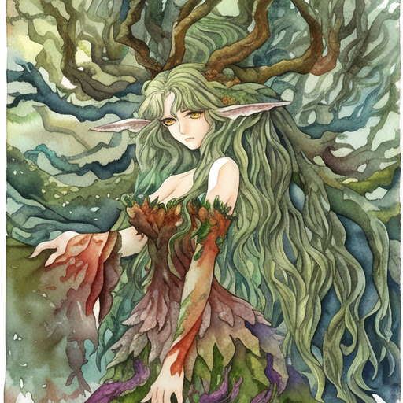
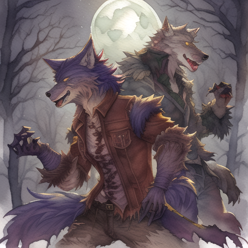

<h1>SOLAS Creature Collection</h1>

A Simply Organized, Lightweight Adventure System

# Combat
Players typically end up in some sort of fight, and this bestiary is here to flesh out encounters with interesting enemies. When using the enemies, feel free to keep track of stamina points for them. As an easier rule, a creature can take as many actions per turn as its **Constitution** score, up to three.

# About Challenge Scores
Balancing combat is a tricky thing to do, especially given the amount of possible player combinations there are. Each creature here has a **Challenge** score, which describes the level of a party that it is an appropriate challenge for. A standard party is considered to be 4 players, but creatures can be scaled for more or fewer players by reducing/increasing the health. Any attacks which specify multiple times per turn are limited to once per player if there are multiple targets within range.

|Challenge Rating|Appropriate For|
|-|-|
|1/4|One (1) player|
|1/2|Two (1) players|
|1|Four (1) players, Two (2) players|
|2|Four (2) players, Two (3) players|

# Centaur
*Wanderers of blasted wastelands, centaur tribes are nomadic hunters who defend their chosen families and territory fiercly. Most were raised in constant threat of other tribes or encroaching humanoids, and carry that distrust and combat readiness with them for the rest of their lives. Those who live for battle gain the status folk heroes, and are referred to across the varied tribes as The Warhungered*

`Do not find yourself running from centaurs, as they will catch up.`

## Centaur
*Heart 25, Speed 10, Light Armor, Challenge 3*

**Strength 4, Dexterity 2, Constitution 3, Mind 1**

**Pike** *2 Tiles, R8 Piercing*

**Hooves** *Melee, R8 Bludgeoning*

## Warhungered Centaur
*Heart 40, Speed 8, Medium Armor, Challenge 5*

**Strength 6, Dexterity 6, Constitution 4, Mind 2**

**Longswords** *Melee, R11 Slashing*
- Each longsword can be used once per turn on different targets

**Greatbow** *12 Tiles, R13 Piercing*
- Can only be used once per turn

# Dryad
*Dryads are tree spirits, chaotic and mischevious souls set to the task of protecting nature. While they're unlikely to stick around to chat, adventurers who get on a dryad's bad side typically avoid forests afterward, if they make it out at all.*

`A group of Dryads is called a tangle. How fitting!`

## Dryad
*Heart 8, Speed 6, Challenge 1*

**Strength 2, Dexterity 2, Constitution 2, Mind 2**

**Bludgeon** *Melee, R3 Bludgeoning*
- Can be used up to 2x per turn

**Tricks**
- Entangle
- Misty Step

## Dryad Tangle
*Heart 12, Speed 6, Challenge 2*

**Strength 4, Dexterity 2, Constitution 3, Mind 3**

***Note**: This is a cluster of 3 dryad spirits. After the Tangle reaches 0 heart, it breaks apart into three **Dryads**, each with 4 heart.*

**Bludgeon** *Melee R5 Bludgeoning*
- Can be used up to 3x per turn

**Tricks**
- Entangle
- Barkskin

# Kulgeli
*The Kulgeli is an intelligent nocturnal predator who seeks out isolated creatures and ensnares them with roots and vines. Some towns that border forests or swamps share stories of a gargantuan creature who blends in with the trees and patiently waits for those foolish enough to wander away. When morning comes, those who go looking find a skeleton with clean bones strung up in a tangle of vines, with the victim's belongings in a neat pile below them.*

***Notes**: While unmoving, it takes a **Mind Check (3)** to spot the Kulgeli.*

`Out past the witching, vines shiver from rest. The vined one awaits a fresh dinner guest.`

## Kulgeli
*Heart 54, Speed 1, Challenge 4*

**Strength 3, Dexterity 2, Constitution 3, Mind 5**

**Grasping Vines** *12 Tiles, R5 Necrotic*
- Can be used up to 2x per turn
- Targets who fail a **Dexterity Check (2)** are pulled 2 Tiles toward the Kulgeli. If the target is within 2 tiles, the target is hoisted up into the air 2 Tiles. Targets who fail remain in the vines and cannot move further away from the Kulgeli until they make a **Strength Check (3)**, taking damage at the start of each of the Kulgeli's turns.

**Cold Clutches** *2 Tiles, R10 Necrotic*
- Can be used up to 2x per turn
- The Kulgeli reaches out and places its hand around the target

# Midas Beetle
*Midas Beetles live in colonies deep in the earth, which can be mistaken for veins of gold in the rock. Usually found in underground caverns or by miners on accident, their bite hardens the surrounding flesh into a material similar to their carapace. A bite subsides after a day or so, but a multitude can cause temporary paralysis, or even death if the bites reach vital organs. Tales are told about unfortunate explorers or miners who fell into a colony and were unable to get out before being untirely covered in bites.*

`There's an old tale of a King Midas whose touch turned things gold. Perhaps he thought it would make a better story than admitting his castle had an infestation of these.`

## Midas Beetle
*Heart 4, Speed 3, Challenge 1/4*

**Strength 1, Dexterity 2, Constitution 1, Mind 1**

**Bite** *Melee, R3 Piercing*
- After a creature is bit, it makes a **Constitution Check (1)**. If it fails, its speed is reduced by two tiles on the next turn. This can stack with other **Midas Beetle** bites.

## Midas Beetle Swarm
*Heart 16, Speed 3, Challenge 1*

**Strength 2, Dexterity 2, Constitution 3, Mind 1**

**Bite** *Melee, R4 Piercing*
- Can be used up to 3 times on different targets
- After a creature is bit, it makes a **Constitution Check (1)**. If it fails, its speed is reduced by two tiles on the next turn. This can stack with other **Midas Beetle Swarm** bites.

# Werewolf
*Humanoids afflicted with a terrible curse take the form of wolves when threatened, or during exposure to the moon. While most flee and try to live out a peaceful life on the outer edges of society, some manage to keep their curse a secret and continue to live amongst others. The more times a werewolf transforms, however, the more of a wolf hybrid they become, with sharper teeth, yellowed eyes, and an elongated face.*

***Notes**: Resistant to physical damage from non-silver weapons*

`Howling at the moon, the gold-eyed wolfman prowls, hunting for a bite`

## Werewolf
*Heart 31, Speed 6, Challenge 3*

**Strength 5, Dexterity 3, Constitution 3, Mind 2**

**Bite** *Melee, R8 Piercing*
- The bitten creature makes a **Constitution Check (1)**. If it fails, it will be afflicted with lycanthropy on the next full moon, provided that they are not cured with wolfsbane or the **Remove Curse** trick.

**Claw** *Melee, R4 Piercing*
- Can be used up to 2 times per turn
